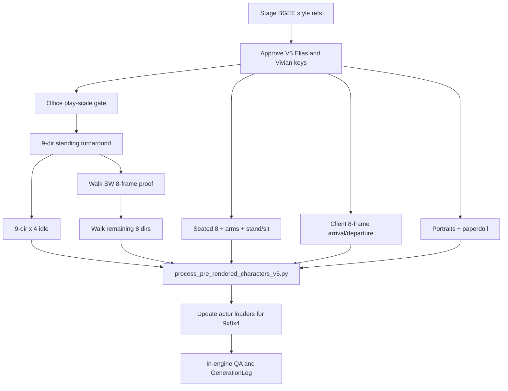

# BGEE Character Sprite Redo Plan (V5)

> **SUPERSEDED (23 July 2026).** The shipped character redesign is **V6**, which replaced this plan's Elias/Vivian regeneration with wholly new BGEE-style identities for the canon leads **Harlan Voss** and **Lila March** at full AssetManifest density (9-direction × 8-frame walks, 4-frame idles, authored sit-down). See `ArtSource/Prompts/character_prerendered_3d_v06.md`, `ArtSource/Processing/process_pre_rendered_characters_v6.py`, and the V6 atlases (`VossWalk`, `VossIdle`, `VossSeatedIdle`, `VossSeatedArms`, `VossSeatTransitions`, `LilaArrival`). This document is retained for history only.

- Status: superseded by the shipped V6 redesign
- Version: 1.0
- Date: 23 July 2026
- Scope choices: **1B** (gameplay actors + dialogue portraits + inventory paperdoll) · **2C** (AssetManifest full animation density)

## 1. Goal

Replace every Elias Vale and Vivian Hart character sprite—including all locomotion/idle/transition animations and identity-locked character UI—with new masters from Cursor’s built-in Image Generator that read as close as possible to Baldur’s Gate: Enhanced Edition avatar craft, while remaining original RainShadow designs.

This is a **style + density** redo of the character pipeline (V5), not a franchise asset copy. Environment plates, props, rain FX, and chrome UI stay on their existing pipelines.

## 2. Why V4 is insufficient

Current shipped look is **V4 crude 1998 mesh + V8 gait** ([`ArtSource/Prompts/character_prerendered_3d_v04.md`](../ArtSource/Prompts/character_prerendered_3d_v04.md)). That pass correctly rejected modern PBR, but the “500–900 triangle / mitten hands” prompt overshot into toy-blocky low-poly rather than true BGEE pre-rendered avatars.

User-supplied BGEE references (copied into the Cursor assets cache for this chat) show the actual target:

| Trait | BGEE reference read | V5 requirement |
|---|---|---|
| Construction | Pre-rendered 3D → small 2D sprite | Same production chain; soft volume, not Minecraft facets |
| Edges | Soft anti-alias against dark/black; no hard comic outline | Soft silhouette; chroma `#00ff00` masters (no baked floor/shadow) |
| Lighting | Upper-left / top-front directional key; readable cloth folds at tiny scale | One neutral baked sprite rig; consistent across all frames |
| Palette | Muted earth + one or two saturated cloth accents | Keep Elias charcoal/cream/red-tie and Vivian burgundy/charcoal; match BGEE *rendering*, not costume |
| Scale | ~100–150 px body in source screenshots | Keep RainShadow contract: 100 px native → 96 colors → 2× nearest → 512×512 |
| Shadow | Soft ground ellipse in some screenshots | Keep separate runtime contact shadow (procedural today); do **not** bake into frames |
| Orientations | BG1/BG2 character schemes use 8–9 authored dirs; EE mirrors eastern arcs ([IESDP avatar naming](https://gibberlings3.github.io/iesdp/appendices/avatarnaming.htm), [INI anim](https://gibberlings3.github.io/iesdp/file_formats/ie_formats/ini_anim.htm)) | Match AssetManifest: **9 stored dirs**, mirror to 16 |

## 3. Deliverable inventory

### 3.1 Detective gameplay (AssetManifest §6.2 — full set)

| Clip | Stored dirs | Frames/dir | Stored frames | Atlas |
|---|---|---:|---:|---|
| `det_walk` | `s ssw sw wsw w wnw nw nnw n` | 8 | 72 | `DetectiveWalk.atlas` |
| `det_standing_idle` | same 9 | 4 | 36 | `DetectiveIdle.atlas` |
| `det_seated_idle` | `se` | 8 | 8 | `DetectiveSeatedIdle.atlas` |
| `det_seated_arms` | `se` | 8 | 8 | `DetectiveSeatedArms.atlas` (synced arm layer) |
| `det_stand_up` | `se` | 12 | 12 | `DetectiveStandUp.atlas` |
| `det_sit_down` | `se` | 12 | 12 | `DetectiveStandUp.atlas` or new `DetectiveSeated.atlas` |

**Detective stored frames: 148** (140 manifest body + 8 arm-layer cells). Displayed walk/idle combinations with mirroring: **224** as in the manifest.

P1 `det_sit_down` is included in this redo so stand↔sit is authored both ways (not a reversed stand-up).

### 3.2 Client gameplay (density-aligned, same registration)

Keep cinematic SW arrival / NE departure, but raise walk density to **8 frames** to match detective BGEE walk cadence:

| Clip | Dir | Frames | Atlas |
|---|---|---:|---|
| `client_arrival_sw` | SW | 8 walk + 1 idle | `ClientArrival.atlas` |
| `client_departure_ne` | NE | 8 | `ClientArrival.atlas` |

### 3.3 Character UI (scope 1B)

| Asset | Size | Path |
|---|---|---|
| `dialogue_portrait_elias_vale_v02` | 512×512 | `Resources/Art/UI/Dialogue/` |
| `dialogue_portrait_vivian_hart_v02` | 512×512 | `Resources/Art/UI/Dialogue/` |
| `det_paperdoll_front_rgba_v03` | 1024×1536 | `Resources/Art/UI/Inventory/` |

Portraits and paperdoll stay **hand-readable inventory/dialogue resolution** (not nearest-pixelized gameplay raster), but must share the same identity and BGEE-adjacent material language as the new keys.

### 3.4 Explicitly out of scope

- Office/exterior/city plates and props
- Inventory item icons, chrome frames, cursors, rain FX
- Enemy/combat animations (none exist yet)
- Copying any BGEE BAM/CRE art or costume designs

## 4. Style-lock gate (must pass before batch animation)

### 4.1 Reference pack

Stage the four user BGEE screenshots into:

```text
ArtSource/References/BGEE/
  bgee_avatar_townsfolk_yellow_red.png
  bgee_avatar_red_tunic_fighter.png
  bgee_avatar_dark_vest_fighter.png
  bgee_avatar_green_robe.png
```

Use only as **style/scale/light/edge** references in Image Generator. Prompt language must forbid copying faces, outfits, or silhouettes.

### 4.2 V5 style contract (prompt nucleus)

Replace V4’s “crude 500–900 triangle / mitten” wording with a BGEE-accurate contract:

> Baldur’s Gate: Enhanced Edition–era Infinity Engine **pre-rendered 3D character avatar**: a simple textured game mesh rendered offline into a small 2D sprite. Soft directional baked light from upper-left, soft anti-aliased silhouette, readable clothing masses, ordinary human proportions, minimal facial features at play scale. Not modern PBR, not concept art, not hand-drawn pixel art, not toy/chibi, not hard black outlines. Flat uniform `#00ff00` chroma; no floor, cast shadow, scenery, text, or watermark.

Keep Elias / Vivian identity locks from [`character_prerendered_3d_v04.md`](../ArtSource/Prompts/character_prerendered_3d_v04.md) (coat, tie, handbag side, no gameplay hat for Elias).

### 4.3 Gate assets

Generate and approve at play scale before any sheet batch:

1. `det_key_se_chroma_v05` — SE standing identity key  
2. `vivian_key_sw_chroma_v05` — SW standing identity key  
3. `style_play_scale_v05` — both keys composited into office preview at runtime scale  
4. Side-by-side QA strip: BGEE refs (style only) vs V5 keys vs rejected V4 keys  

**Exit gate:** at ~100 px body height, V5 reads closer to the BGEE refs than V4 on softness, edge treatment, and cloth shading—while remaining recognizably Elias/Vivian.

Document the lock in `ArtSource/Prompts/character_prerendered_3d_v05.md`.

## 5. Generation plan (Image Generator)

### 5.1 Method

1. **Reference / edit mode** with approved V5 key + prior pose sheet (or previous phase) as structural anchors.  
2. One source direction (or one short strip) at a time to prevent identity drift.  
3. Reject on first coat/face/handbag/light-direction break; regenerate that cell, do not “average” later.  
4. Log every `exec-*.png` → retained master → runtime path in [`ArtSource/Prompts/GenerationLog.md`](../ArtSource/Prompts/GenerationLog.md).

### 5.2 Sheet layouts (masters)

Prefer equal-cell chroma sheets that the Python slicer can crop reliably:

| Sheet | Layout | Notes |
|---|---|---|
| Walk (per direction or 9-row) | 8 columns × 1–9 rows | Contact / pass / opposite contact / …; BG1-style ~8-frame walk ([IESDP](https://gibberlings3.github.io/iesdp/appendices/avatarnaming.htm)) |
| Standing idle | 4 columns × 9 rows (or 9 strips of 4) | Broad mass shift only |
| Seated idle | 8-wide strip SE | Breath + glance; includes arm-layer source |
| Stand-up / sit-down | 4×3 grids SE | Endpoints must match seated/standing keys |
| Client arrival | 8-wide SW + idle | Handbag anatomical left fixed |
| Client departure | 8-wide NE | Same |
| Portraits | Single 512 masters | Identity from V5 keys |
| Paperdoll | Single front 1024×1536 | No hat; match V5 Elias |

If the Image Generator struggles with 9×8 density in one image, split into **per-direction strips** (proven in WalkV2 / gait V5–V8 history) rather than lowering frame count.

### 5.3 Order of work



**Critical path:** keys → SW walk proof (gait + style) → remaining walk dirs → idle → seated chain → client → UI → process → code → QA.

## 6. Processing pipeline

### 6.1 New script

Add [`ArtSource/Processing/process_pre_rendered_characters_v5.py`](../ArtSource/Processing/process_pre_rendered_characters_v5.py) that:

- Reuses chroma remove / `pixelize_figure` / `register` from V3 (`100px`, `96` colors, `FOOT_Y=434`, `512` canvas).  
- Accepts **9 directions** and **8 walk / 4 idle** phases.  
- Backs up current atlases to `ArtSource/Generated/Characters/RuntimeBackupPreRendered3DV5/`.  
- Deletes Finder duplicates (`* 2.png`) while rewriting atlases.  
- Writes office composite preview `preview_characters_in_office_v05.png`.  
- Processes portraits/paperdoll with chroma cleanup only (no nearest-pixelize pass).

Tune only if play-scale QA demands it (e.g. palette 96→128); do not change pivot/scale contracts without updating [`OfficeInteriorScale.swift`](../RainShadow%20Shared/Gameplay/Navigation/OfficeInteriorScale.swift).

### 6.2 Master locations

```text
ArtSource/Generated/Characters/Detective/PreRendered3DV5/
ArtSource/Generated/Characters/Client/PreRendered3DV5/
ArtSource/Generated/UI/Dialogue/   # portrait v02 masters
ArtSource/Generated/Characters/Detective/Paperdoll/  # v03
```

## 7. Runtime / engineering updates

`ActorFacing.textureSourceCandidates` already prefers `ssw` / `wsw` / `wnw` / `nnw` when present ([`ActorLocomotion.swift`](../RainShadow%20Shared/Gameplay/Navigation/ActorLocomotion.swift)). Remaining code changes:

| File | Change |
|---|---|
| [`DetectiveActorNode.swift`](../RainShadow%20Shared/Gameplay/Actors/DetectiveActorNode.swift) | Load walk `(0..<8)`; idle 4 frames/dir with hold timing; seated 8 + arms 8; play authored `det_sit_down` |
| [`ClientActorNode.swift`](../RainShadow%20Shared/Gameplay/Actors/ClientActorNode.swift) | Arrival/departure 8-frame cycles; keep idle bob on final arrival frame |
| [`ActorLocomotionPacing.swift`](../RainShadow%20Shared/Gameplay/Navigation/ActorLocomotionPacing.swift) | Retune seconds/frame so 8-frame walk retains ~same stride time as today’s 4-frame/0.18s loop |
| [`GameArt.swift`](../RainShadow%20Shared/Core/Assets/GameArt.swift) | Atlas membership / preload lists for new names |
| Dialogue / inventory UI | Point to portrait `v02` and paperdoll `v03` |
| Tests | Update any texture-count assumptions in actor/sequencer tests |

Optional follow-up (not blocking V5 ship): move clip tables into `detective.animations.json` as sketched in Technical Architecture—keep hardcoded Swift for this redo if timelines collide.

## 8. Acceptance criteria

### Style
- Side-by-side at play scale: V5 closer to BGEE refs than V4 on edge softness, volume, and cloth shading.  
- No hard outlines, no PBR shine, no identity drift across the first full walk cycle.  
- Coat/handbag bilateral enough that eastern mirrors do not expose swapped props.

### Technical (from AssetManifest §6.3)
- Pivot jitter ≤ 2 runtime px; crown height jitter ≤ 2 px.  
- Walk loop seamless at 0.25×.  
- ≥12/16 facings identified correctly without labels.  
- No chroma fringe on lamp/window backgrounds.  
- Actor height stays in 8–11% of playable view band.

### Product
- Office intro: seated idle → stand-up → 16-facing walk/idle.  
- Sit-down returns to desk without pop.  
- Vivian arrival/departure cadence matches detective walk feel.  
- Dialogue portraits and inventory paperdoll match V5 identity.

## 9. Risk register

| Risk | Mitigation |
|---|---|
| Identity drift across 140+ frames | Key lock + one-direction reference-edit chain; reject early |
| Generator fails on dense 9×8 sheets | Per-direction 8-frame strips (WalkV2 pattern) |
| Soft BGEE look becomes too smooth after 96-color pass | QA at runtime nearest scale; raise palette only if needed |
| Mirror breaks asymmetric props | Keep near-bilateral coat; handbag only on Vivian cinematic dirs (authored, not mirrored) |
| Scope creep into env art | Hard out-of-scope list in §3.4 |
| Copyright | Style references only; original costumes/faces always |

## 10. Effort sketch

| Phase | Work |
|---|---|
| A. Style lock | Refs staged, V5 keys, play-scale gate, prompt doc |
| B. Detective locomotion | 9×8 walk + 9×4 idle |
| C. Desk chain | Seated 8+arms, stand-up 12, sit-down 12 |
| D. Client | 8+1 arrival, 8 departure |
| E. Character UI | 2 portraits + paperdoll |
| F. Pipeline + code | `process_*_v5.py`, actor loaders, pacing, UI paths |
| G. QA | In-engine, GenerationLog, atlas cleanup |

Estimated generation volume: **~20–40 Image Generator jobs** depending on sheet packing success (keys + ~9 walk strips + idle sheets + seated/standup/sit + client + 3 UI), then one processing pass and a focused Swift update.

## 11. First execution step

When implementation starts: stage BGEE refs → write `character_prerendered_3d_v05.md` → generate and approve `det_key_se_chroma_v05` against the four references before any animation batch.
