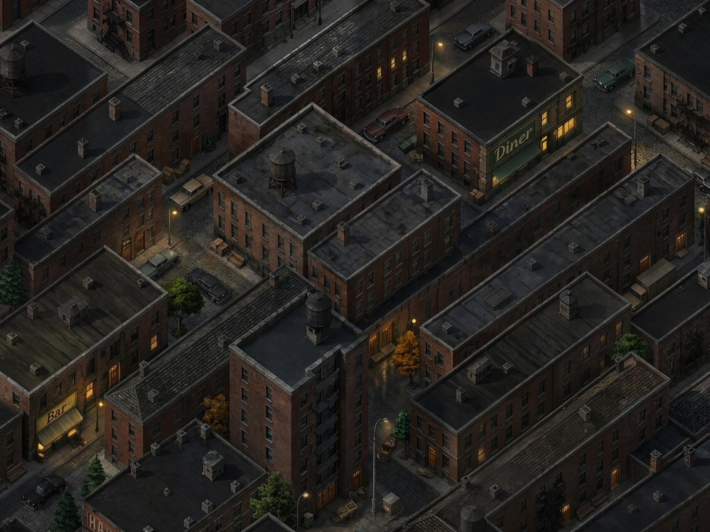
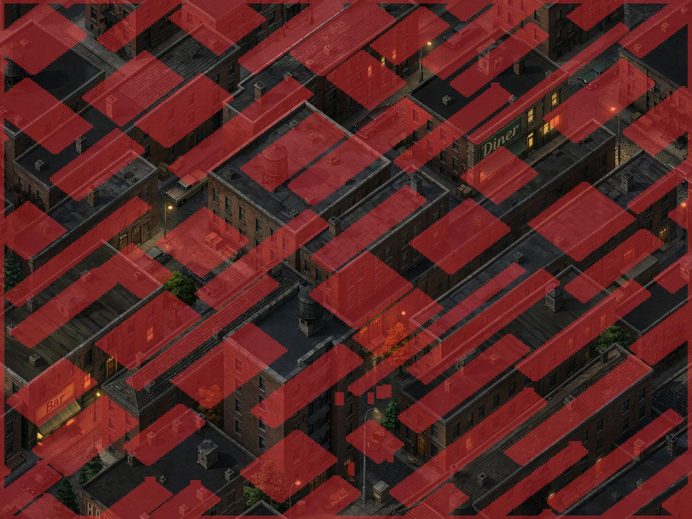
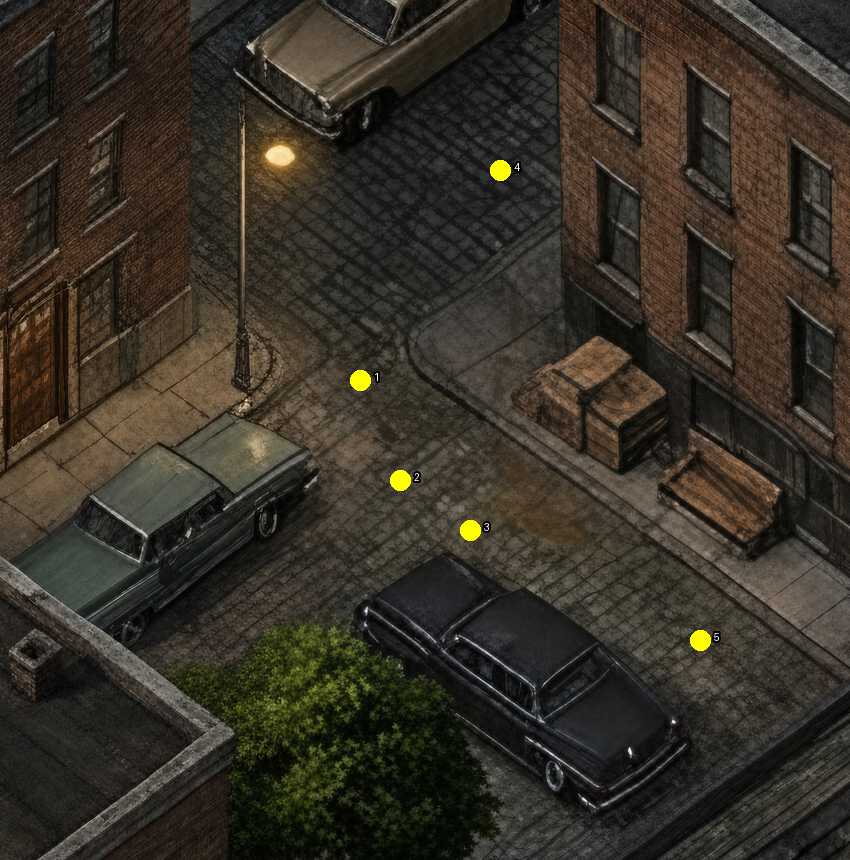

# Infinity Engine areas and the current Sable Row

Research and checkout audit: 6 September 2026. Scope: the Baldur's Gate family of Infinity Engine areas, their production process, and whether the currently installed Sable Row meets the same practical standard. No runtime code, area records or shipped art were changed.

The conclusion is that **Sable Row has several appropriate engine mechanisms, but its current painting and gameplay geometry do not describe the same place. Its composition also falls short of the supplied Baldur's Gate reference.** Neither issue is solved by increasing resolution or using the dimensions of an existing BG area.

“An engine could load this” and “this works as a finished Baldur's Gate-style area” are different acceptance questions. RainShadow uses Swift/SpriteKit and its own resource formats; this audit does not certify a literal ARE/WED/TIS export or a successful load in the original executable.

## What makes an Infinity Engine area

An area combines a precomputed view of a location with separately authored spatial and gameplay data. Animated characters inhabit that view. The background does not provide runtime 3D geometry from which the engine can discover walls, doors or lighting. Different IE games have different capabilities; GemRB is a compatible reimplementation, not BioWare's original source. [GemRB engine overview](https://gemrb.org/Engine-overview.html).

| Resource or system | Responsibility |
|---|---|
| TIS, plus PVRZ in the Enhanced Editions | The background's graphic tiles. Classic tiles have individual palettes; EE tiles can reference compressed texture pages. |
| WED | Placement of background tiles and overlays, wall polygons, and door-related graphic state. |
| SR bitmap | Terrain classification used for movement and other terrain-dependent behavior. |
| LM / night lighting data | Spatial lighting information applied to inhabitants. |
| HT bitmap | Small visual elevation adjustments to sprites. |
| ARE | Actors, doors, entrances, regions, containers, ambients, variables and other area content. |
| Scripts and referenced resources | Behavior, dialogue, creatures, items, effects and encounters. |
| Small map and world map | Local orientation and inter-area travel. |

TIS graphics are distinct from WED placement. Both classic palette-based and EE PVRZ-based storage exist; a single globally restricted background palette is not a universal requirement. [IESDP TIS specification](https://gibberlings3.github.io/iesdp/file_formats/ie_formats/tis_v1.htm).

WED uses **64×64 rectangular image tiles**. These are storage coordinates, not a requirement to design the city as repeated diamond-shaped lots. WED also supports overlays, commonly water, and open/closed door graphics. Wall outlines control covering of creature animations. A continuous-looking area can be assembled during production; it does not have to originate in one image-generation call or one indivisible source file. The final visual and spatial registration are what matter. [IESDP WED specification](https://gibberlings3.github.io/iesdp/file_formats/ie_formats/wed_v1.3.htm).

## Size, camera and scale

**80×60 tiles is not the mandatory outdoor area size.** I read the base WED records in the local Baldur's Gate: Enhanced Edition installation:

| Area | WED tile dimensions | Background pixels | Search bitmap dimensions |
|---|---:|---:|---:|
| AR0100 | 67×50 | 4288×3200 | 268×267 |
| AR0200 | 69×50 | 4416×3200 | 276×267 |
| AR0300 | 69×50 | 4416×3200 | 276×267 |
| AR0400 | 80×60 | 5120×3840 | 320×320 |
| AR0500 | 80×60 | 5120×3840 | 320×320 |
| AR0600 | 67×52 | 4288×3328 | 268×278 |
| AR0700 | 69×52 | 4416×3328 | 276×278 |
| AR0800 | 69×52 | 4416×3328 | 276×278 |

These are measurements of packaged resources, not minimums or maximums. The supplied `AR0100.PNG` is 4288×3328; the local AR0100 background visually matches its main scene but is 128 pixels shorter. The supplied bottom strip should therefore not be used to infer the WED extent or a deliberate composition rule.

GemRB's area importer derives the property grid as `XCellCount * 4` columns and `CeilDiv(YCellCount * 64, 12)` rows: one cell corresponds to 16×12 background-coordinate units. The rectangular search cell is a separate grid from the 64×64 graphic tile. [Pinned GemRB ARE importer](https://raw.githubusercontent.com/gemrb/gemrb/1c45c185/gemrb/plugins/AREImporter/AREImporter.cpp).

Neither image size nor a measured pair of diagonal slopes certifies visual quality. The area renderer consumes projected pixels; it has no general architectural-camera validator. RainShadow's ±0.75 axes are a project art-registration contract. They should remain stable for existing content, but should not be presented as an engine rule that every building must face those same two screen directions. Rotating a building on a common ground plane changes its projected edge slopes without changing the camera. This is a geometric inference, not a proposal to alter the port.

Actor-to-door scale must be judged in the displayed coordinate system. Likewise, native source detail matters more than the final exported canvas size. Comparing two overview thumbnails at different magnifications cannot establish either. The 2.0 source-pixels-per-world-unit floor and the 1.05–1.35 adult-height door band are RainShadow acceptance policies, not IE file-format limits.

## Movement, visibility, cover and elevation are separate authoring tasks

The search map assigns terrain classes rather than simply encoding black versus white. The documented BG2 table distinguishes ordinary ground, walls, roofs, impassable water and travel boundaries, and associates surfaces with footsteps. Numeric class identity matters; changing palette colors does not define new behavior. Exact visibility/travel details must be checked against the target game or pinned implementation because the IESDP summary and GemRB's flags do not agree in every detail. [IESDP search-map table](https://gibberlings3.github.io/iesdp/appendices/search.html).

A **collision footprint** describes where an actor's feet can go. An **occlusion outline** describes which painted pixels can cover an actor. They are not interchangeable: a roof, tree crown or tall facade can project far beyond the ground footprint. Roof pixels over an otherwise walkable cell are not, by themselves, proof of a bug; a street behind a building may legitimately occupy that coordinate. A convincing diagnosis needs unobstructed street witnesses or a correctly interpreted silhouette overlay.

GemRB's drawing path selects covering walls and draws polygon stencils. This makes the exact painted outline important, even when collision is correct. RainShadow already implements a per-pixel stencil, so mismatched authoring should be repaired at its source rather than hidden with whole-character transparency. [Pinned GemRB map rendering](https://raw.githubusercontent.com/gemrb/gemrb/1c45c185/gemrb/core/Map.cpp).

The height map is not a second navigable floor or a runtime mesh. In the pinned GemRB implementation, its value maps to a small −7…+7 sprite offset. It cannot give one search coordinate two independently walkable bridge levels. Such spaces need suitable area design, transitions or special handling. [Pinned GemRB tile properties](https://raw.githubusercontent.com/gemrb/gemrb/1c45c185/gemrb/core/TileProps.cpp).

Near Infinity exposes search, light and height maps as separate overlays and separately shows wall polygons, doors and impeded door cells. That is a useful review model: inspect each layer against the same background and then verify the combined result in play. [Near Infinity Area Viewer documentation](https://github.com/NearInfinityBrowser/NearInfinity/wiki/Documentation-Area-Viewer).

## Doors, travel and a living area

A painted doorway is not automatically interactive. ARE door state and travel regions are separate records; travel identifies another area and its named entrance. Doors have interaction geometry and state-dependent impeded cells. Areas can also contain information regions, traps, containers, scheduled actors, ambient sounds and local variables. Outdoor, city, weather and day/night flags describe behavior rather than guaranteeing that the associated art is complete. [IESDP ARE specification](https://gibberlings3.github.io/iesdp/file_formats/ie_formats/are_v1.htm).

The world map is another resource, with area entries and travel links. It is not a seamless extension of the area painting. An exterior can have inaccessible scenery, separate interiors and transitions at its boundary without being invalid. [IESDP world-map specification](https://gibberlings3.github.io/iesdp/file_formats/ie_formats/wmap_v1.htm).

There is no minimum NPC or doorway quota. However, a finished urban adventure area needs destinations and behavior appropriate to its purpose. The base local AR0100 record contains **43 actor records, 30 regions, 11 doors and 19 containers**. Sable Row's current JSON contains **0 area actors, 1 region, 1 door and 0 containers**. These counts are not concurrent visible populations, and the player is not counted as a local area actor. They are evidence of a content gap, not a binary compatibility failure.

## How BioWare produced the areas

Ray Muzyka's first-person account describes design/layout, isometric concept work, modeling, placement/texturing, dressing/lighting, then authoring the clipping and auxiliary maps against the artwork, followed by gameplay population and scripting. He also identifies insufficient early testing and communication failures as production problems. His account gives a BG2 performance guideline of six by six 640×480 screens; this was a production budget, not a universal format limit. [BioWare: The Anatomy of a Sequel](https://www.gamedeveloper.com/design/-i-baldur-s-gate-ii-i-the-anatomy-of-a-sequel).

The applicable lesson for RainShadow is to keep level design, painting and spatial authoring in registration throughout production. A generated image can be useful art input, but a prompt asking it to preserve positions does not prove that it did. After any repaint, the actual pixels need to be checked against paths, doors and cover.

## What the supplied reference does well

The following are visual observations, not claims about engine requirements:

- The wall and towers establish a large organizing boundary. The compound, courtyard and surrounding streets form distinct spaces.
- Different building footprints, heights and roof forms give different parts of the area identities. Architecture is not uniformly oriented or equally prominent.
- Streets widen, narrow, turn and arrive at destinations. Open space has uses: circulation, enclosure, garden, threshold and meeting place.
- Ground, walls, roofs and vegetation separate clearly enough to read routes. Repeated props such as lamps support that structure without becoming the structure.
- The crop suggests a city continuing beyond its edges. The painting can contain inaccessible scenery without looking like a floating collection of game pieces.

For a 1950s district, the equivalents might be an apartment court, service alley, intersection, loading yard and a distinctive public frontage. Medieval buildings, grass coverage and the reference's exact street plan are not required.

## What currently ships in Sable Row

The audit follows the installed **page manifest**, not the similarly named fallback PNG:

- `city_sable_row_day_v01.pages.json` identifies **IENativeDetailV16**.
- The master is 10240×7680 over 5120×3840 world units, at 2.0 pixels per world unit.
- There are 25 JPEG pages, each 2048×1536. All 25 files matched their recorded SHA-256 values during this audit.
- The provenance binds 64 native-detail source windows. General area props are empty.
- The night-placeholder manifest contains exactly the same page records as the day manifest.
- The JSON contains 1228 obstacle rectangles and 86 cover polygons, with 320×320 search, light and height images.

The V15 descriptions in `SableRowIEOutdoor.md` and `InfinityEngineCityAreas.md` are stale. The fallback `city_sable_row_day_v01.png` shows a much older, visibly modular arrangement. Reviewing that file would criticize a different background from the normal paged rendering path.

### Finding 1: painted streets disagree with collision

The red overlay below combines the shipped search bitmap with conservative obstacle stamping and the initially closed door. It is a read-only Python reconstruction of the static blocking rule, not a captured runtime navigation debugger. It excludes actor occupancy and actor-radius clearance.

The raw bitmap has 54,354 blocked cells; the static union has 54,547 of 102,400 cells. The additional 193 cells are not the central problem: the underlying spatial layout already disagrees with the painting.

The following witnesses are visibly unobstructed cobbled road, not hidden ground under a foreground roof:

| Witness | World coordinate, y-up | Shipped terrain | Static result |
|---|---:|---|---|
| 1 | (1340, 2080) | 0: obstacle | Blocked |
| 2 | (1380, 1980) | 0: obstacle | Blocked |
| 3 | (1450, 1930) | 0: obstacle | Blocked |
| 4 | (1480, 2290) | 13: roof | Blocked |
| 5 | (1680, 1820) | 0: obstacle | Blocked |

`build_city_ie_monolith_v06.py:build_sidecars` builds the architecture mask from `city_ie_street_plan`; the painting preview is used for lighting and the map image, but not for the architecture/search mask. Therefore a painting can change substantially while the collision plan remains internally consistent with an older layout.

### Finding 2: cover outlines do not describe the visible silhouettes

`AreaCoverAuthoring.districtWallPolygons()` turns `CityStreetPlan` mass vertices directly into cover polygons. On the current painting these outlines cut through roofs and facades and cross exposed streets. This is not a small edge-resolution problem. It means the per-pixel stencil can apply cover to the wrong portions of an actor. The visible symptom still needs a runtime walk behind representative corners, but the geometric disagreement is directly inspectable.

### Finding 3: the image lacks spatial variety at the area scale

The current painting is much more cohesive than the fallback PNG. It has plausible brick materials, coherent neighborhood architecture and street dressing. Nevertheless, long parallel building masses dominate almost the entire frame. Roofs and facades consume much of the view; the streets between them have relatively little variation in purpose or prominence. There is no comparably strong organizing landmark and sequence of distinct spaces to the reference's wall, compound and public streets.

This is a visual/design judgment. Dense tenements and orthogonal streets are compatible with an IE-style city. They still need intentional pacing, readable routes, destinations and enough exposed ground for the intended encounters.

### Finding 4: content and time-of-day authoring are incomplete

One authored apartment transition across this much painted city leaves most of its implied destinations as scenery. No local NPCs or containers are authored in this area record. All three ambient records currently reference the rain asset, including the one called `amb.foghorn`; names alone do not supply distinct city soundscapes.

The day/night hook exists, but the two manifests alias the same images. A storage/size test can pass without a separately authored night appearance. The record calls this a placeholder, appropriately.

### Finding 5: the existing green checks are insufficient

Measured against the installed page set:

| Check | Result | What it does not establish |
|---|---|---|
| Source/stored density | 2.00 / 2.00 px per world unit: PASS | Composition, playability or pixel-to-map alignment |
| Projection estimator on a page reconstruction at 1 px/world unit | +35.99° / −35.41°; worst deviation 1.46°: PASS at 1.5° | Every local structure's correctness or spatial registration |
| Duplicate-patch metric | 0.0%, 48 sampled patches | Variety of forms, landmarks or playable spaces |
| Search-map lattice metric | 0.224, 39 components: PASS | Whether that search map follows the painting |
| Page hash verification | 25/25 match | Whether the approved content is good |

The lattice measurement reads the search map; it cannot certify the composition of unrelated painted buildings. Likewise, `sableRowWallPolygonsCoverTheLattice` checks the number of mass records and their cover flags, not their overlap with the actual artwork.

Two QA cautions surfaced during inspection. The projection CLI opens image files directly and cannot consume a `.pages.json`; this audit explicitly reconstructed the page image first. The composition and reference-extraction scripts use `[0,12,13,14,15]` as their blocked set, inconsistent with RainShadow's movement table. Substituting `[0,8,10,12,13,14]` in memory did not change Sable's lattice result because its raster contains only 0, 7, 13 and 14. Historical BG comparison baselines still need separate revalidation before those values are treated as authoritative.

The density command also reported failures for five other wards and the shared building interior. Those are existing wider art issues; this audit's detailed spatial diagnosis is limited to Sable Row.

## Recommended Sable Row acceptance process

1. **Design one playable district.** Establish the entry, Voss's door, a recognizable public destination, a secondary route, and the intended boundary transitions. Choose area extent based on those spaces and walking time. Retain any existing dimensions until a redesign is explicitly implemented.
2. **Approve the composition at gameplay scale.** Use actual actor size and camera framing. Check intersections, courts, alleys, parked cars, sightlines and the amount of ground visible behind tall buildings. Review routes and landmarks as well as the overview.
3. **Bind all spatial data to one accepted painting revision.** Author physical footprints, terrain, door locations and painted cover silhouettes as distinct layers. They may share source geometry, but may not substitute for one another. Record the painting/page hashes that each layer was reviewed against.
4. **Complete interaction and atmosphere.** Validate each intended doorway and return entrance; add the planned people, information points, sounds and state changes. Author a night treatment if the district needs one.
5. **Review the composite in motion.** Walk the actor along both sides of representative buildings, around cars, across intersections and through every required transition. Check cover, collision, lighting, fog and local-map registration together. Route success alone does not prove that the route stays on painted ground.
6. **Retain numeric gates, add registration witnesses.** Keep density and projection checks. Add authored positive/negative navigation witnesses tied to the current image, image overlays for occlusion review, and exact reachability checks for required approaches. Validate page loading and seams at actual zoom. A green schema or count test cannot replace this review.

The immediate corrective work is **area authoring and registration**. The protected navigation, tint, zoom and stencil algorithms should not be changed to compensate for a painting/data mismatch. Any desired behavior change to those ports needs its own upstream comparison and decision.

## Evidence and limits

The images in `AreaAudit20260906/` are diagnostic derivatives of RainShadow's installed pages. The broad overview is reduced for inspection; the junction crop was reconstructed at one image pixel per world unit. No independent master or legacy fallback was substituted for the runtime page set.

Binary reference measurements used `extract_ie_reference`'s KEY/BIFF readers against the local BG:EE installation, reading WED dimensions and ARE header counts directly. They describe packaged records, not a saved game's current state. The blocked-cell reconstruction follows `SearchMap`'s positive-area rectangle overlap and `AreaSearchMapLoader`'s y orientation; the witnesses are also blocked in the raw shipped bitmap and do not depend on the reconstruction.

Research sources are linked beside the relevant claims. Source-code behavior is pinned to GemRB `1c45c185` where cited. The supplied reference and local AR0100 rendering were visually compared. No original-engine import, new game build, runtime walk-through or Swift test execution was performed for this documentation-only audit. The report establishes content/data disagreement and review gaps; it does not assert that every runtime feature has been exercised or that all IE variants share identical limits.
