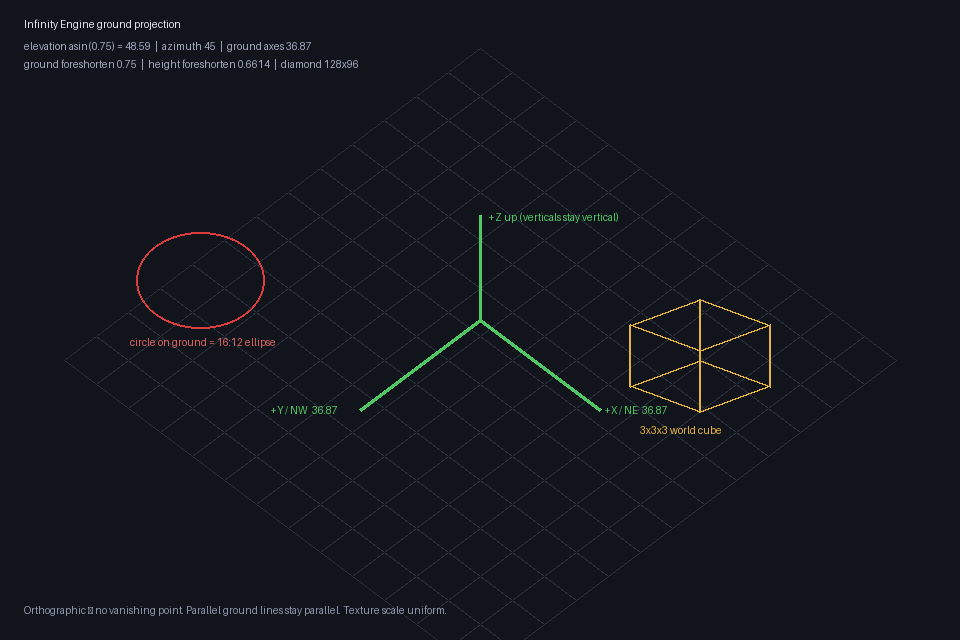

# Infinity Engine ground projection

Canonical area-art camera for RainShadow. Matches Baldur's Gate: Enhanced Edition
/ GemRB searchmap geometry. Shared constants live in
`ArtSource/Processing/ie_projection.py`.



## Camera (orthographic)

| Parameter | Value |
|---|---|
| Elevation | `asin(0.75)` ≈ **48.59°** |
| Azimuth | **45°** (ground axes symmetric on screen) |
| Ground axes on screen | `atan(0.75)` ≈ **36.87°** from horizontal |
| Ground foreshortening | **0.750** screen-Y per world-Y |
| Height foreshortening | `sqrt(1 − 0.75²)` ≈ **0.6614** |
| Projection | Orthographic — no vanishing point, no horizon |
| Verticals | Stay vertical |

Parallel ground lines stay parallel across the entire plate. Texture scale is
uniform regardless of location on the map.

## Ground circle → 16:12 ellipse

A circle on the ground projects to a **16:12 (4:3) ellipse**. This is the same
ratio GemRB uses for selection circles (`IsWithinEllipse`) and searchmap cells
(`SearchmapPoint(x/16, y/12)`). RainShadow's runtime `SearchMap.defaultCellSize`
is already `16×12` world units, and `ActorLocomotionPacing.verticalProjectionScale`
is already `0.75`.

## Nav diamond

| Lock | Diamond | Half-steps | Notes |
|---|---|---|---|
| **Current (BG:EE)** | **128×96** | **64 / 48** | Spans exactly 8×8 SearchMap cells |
| Retired (2:1 dimetric) | 128×64 | 64 / 32 | ~30° elevation; ground axes ~26.6° |

Authored forward projection (y-up plate space):

```text
x = originX + (c - r) * 64
y = originY + (c + r) * 48
```

## Height extrusion

World-up height `H` becomes `H × 0.6614` screen pixels. Uprights do not taper
and do not shear — only the ground footprint follows the ±0.75 axes.

## Authoring checklist

1. Generate masters against this camera (see `ArtSource/Prompts/city_perspective_lock_v03.md`
   and the office suite prompt lock). Do not use the retired 2:1 / ~30° lock.
2. Floor diamonds and wall bases follow slopes **±0.75**.
3. Ground markers, selection rings, and floor ripples use a **16:12** ellipse on a
   **128×96** canvas.
4. Validate reachability with flood-fill of the runtime search map (`path`, never
   `route`). See `Documentation/PathfindingSystem.md`.
