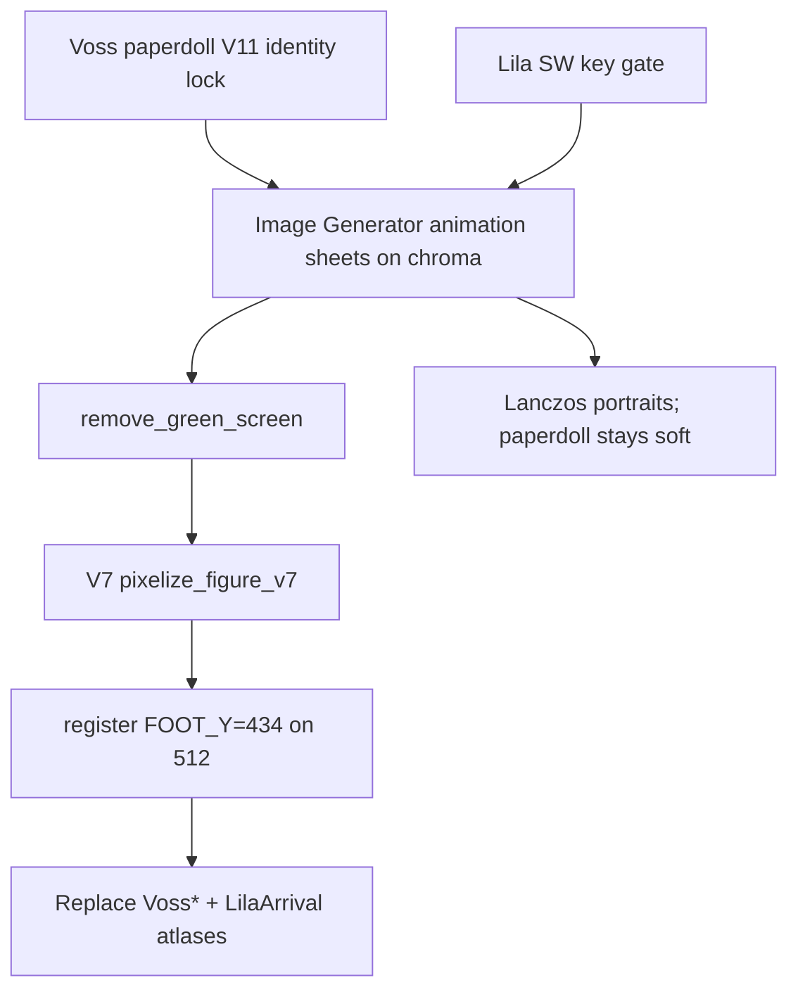

# Paperdoll → BGEE Sprite Redo Plan (V11)

- Status: superseded for Voss room sprites by [PaperdollBGEESpriteRedoPlanV12](PaperdollBGEESpriteRedoPlanV12.md) (Voss V12 installed). Lila V11 bob/dress content from this pass remains current.
- Version: 1.0
- Date: 2 August 2026
- Scope: **Harlan Voss full atlas set** + **Lila March arrival/departure set** + matching dialogue portraits; inventory paperdoll already shipped as pose V11

## 1. Goal

Treat the approved high-resolution Voss inventory paperdoll as the “pre-rendered 3D model” identity source (Baldur’s Gate: EE production metaphor), regenerate all gameplay animation masters to match that look, then run the existing **V7 BGEE preprocess** (80 px native body → 64-color opaque-only palette → nearest upscale to 200 px texture body on 512×512) to replace the shipped atlases.

Lila is regenerated in the same pass with a new 1940s wardrobe and bob haircut, same raster crunch, same atlas IDs.

## 2. Why this pass

| Current | Problem |
|---|---|
| Voss room sprites (V8) | Soft BGEE craft, but still a separate identity key from the polished paperdoll; fedora on every actor cell |
| Paperdoll V11 | Correct bare-headed inventory idle / face / wardrobe; not yet driving room sprites |
| Lila V10 | Long dark hair + emerald swing coat; user wants chic blunt bob + more figure-flattering 1940s look (still under-15 suitable) |

This is **not** runtime paperdoll composition. Masters stay offline Image Generator sheets; SpriteKit keeps loading the same atlas filenames.

## 3. Pipeline (BGEE metaphor → RainShadow)

Approved preprocess (unchanged contract from [`process_pre_rendered_characters_v7.py`](../ArtSource/Processing/process_pre_rendered_characters_v7.py)):

1. Soft-matte chroma key from `#00ff00` masters
2. Premultiplied downsample to **80 px** native body height
3. **64-color** MEDIANCUT palette from **opaque figure pixels only**, no dither
4. Nearest upscale to **200 px** texture body
5. Register on **512×512**, `FOOT_Y = 434`
6. SpriteKit nearest filtering at 256 pt display

Portraits and the inventory paperdoll **skip** nearest-pixelize (hand-readable).

## 4. Identity locks

### 4.1 Harlan Voss

- **Identity master:** [`voss_paperdoll_front_chroma_v11.png`](../ArtSource/Generated/Characters/Detective/Paperdoll/voss_paperdoll_front_chroma_v11.png) (runtime `voss_paperdoll_front_rgba_v01`)
- **Hat:** none — remove fedora from all gameplay sprites for this pass
- **Keep:** early-thirties clean-shaven face, short dark hair, olive-brown rumpled overcoat, mustard waistcoat, cream shirt, dark green tie, charcoal trousers, brown shoes
- **Camera for sheets:** orthographic 2:1 dimetric office camera (not inventory front); paperdoll locks face/wardrobe/materials only
- **Gameplay SE key gate:** generate `voss_key_se_chroma_v11.png` from paperdoll identity before batch sheets

### 4.2 Lila March

- **Hair:** chic chin-grazing textured blunt bob; soft side part; airy lived-in finish; dark brown
- **Clothes (1940s, figure-flattering, under-15 suitable):** fitted deep-emerald day dress with nipped waist and thin belt; modest scoop neckline (collarbone OK, no cleavage); cap or short sleeves; knee-to-just-below-knee skirt with soft flare; dark pumps; compact dark handbag on anatomical left; no beret, no swing coat, no long hair, no gloves
- **Hard rejects:** lingerie, sheer blouse, mini skirt, deep V-neck, modern glam / PBR, childlike proportions
- **SW key gate:** `lila_key_sw_chroma_v11.png` before batch sheets

## 5. Deliverable inventory

### 5.1 Voss gameplay (AssetManifest §6.2 — full set)

| Clip | Dirs | Frames | Atlas |
|---|---|---:|---|
| `voss_walk` | 9 | 8 | `VossWalk.atlas` |
| `voss_standing_idle` | 9 (+ mirrored SE) | 4 | `VossIdle.atlas` |
| `voss_seated_idle` | SE | 8 | `VossSeatedIdle.atlas` |
| `voss_seated_arms` | SE | 8 derived | `VossSeatedArms.atlas` |
| `voss_stand_up` / `voss_sit_down` | SE | 12 each | `VossSeatTransitions.atlas` |

Stored body cells: **140** (+ 8 arm overlays). Runtime eastern mirrors unchanged.

### 5.2 Lila gameplay

| Clip | Dir | Frames | Atlas |
|---|---|---:|---|
| Arrival walk + idle | SW | 8 + 1 | `LilaArrival.atlas` |
| Departure | NE authored; NW = flip of NE | 8 + 8 | `LilaArrival.atlas` |

### 5.3 Character UI

| Asset | Processing | Path |
|---|---|---|
| `dialogue_portrait_harlan_voss_v01` | Lanczos → 512; replace in place or bump ID if needed | `UI/Dialogue/` |
| `dialogue_portrait_lila_march_v02` | Lanczos → 512; refresh to bob + dress | `UI/Dialogue/` |
| `voss_paperdoll_front_rgba_v01` | Already V11 pose; do not nearest-pixelize | `UI/Inventory/` |

## 6. Execution order

1. Approve play-scale crunch of `voss_key_se_chroma_v11` vs paperdoll + BGEE refs
2. Approve play-scale crunch of `lila_key_sw_chroma_v11` vs new hair/dress lock
3. Batch-generate Voss locomotion + desk-chain sheets under `Detective/PreRendered3DV11/`
4. Batch-generate Lila strips under `Client/PreRendered3DV11/`
5. Run [`process_pre_rendered_characters_v11.py`](../ArtSource/Processing/process_pre_rendered_characters_v11.py) (backs up current atlases, installs V7-crunched cells, previews)
6. In-engine QA: pivot ≤2 px, silhouette directions, face/wardrobe continuity, no fedora, Lila bob + dress read at office scale
7. Update AssetManifest / GDD look lines (already drafted with this plan)

## 7. Explicitly out of scope

- Changing registration, display size, or runtime mirroring code
- Office/city plates, props, rain FX, UI chrome
- Applying V7 crunch to the inventory paperdoll
- Franchise costume or BAM copies

## 8. Prompt and processor

- Style lock: [`ArtSource/Prompts/character_prerendered_3d_v11.md`](../ArtSource/Prompts/character_prerendered_3d_v11.md)
- Processor: [`ArtSource/Processing/process_pre_rendered_characters_v11.py`](../ArtSource/Processing/process_pre_rendered_characters_v11.py)
- Crunch primitive: `pixelize_figure_v7` from V7
