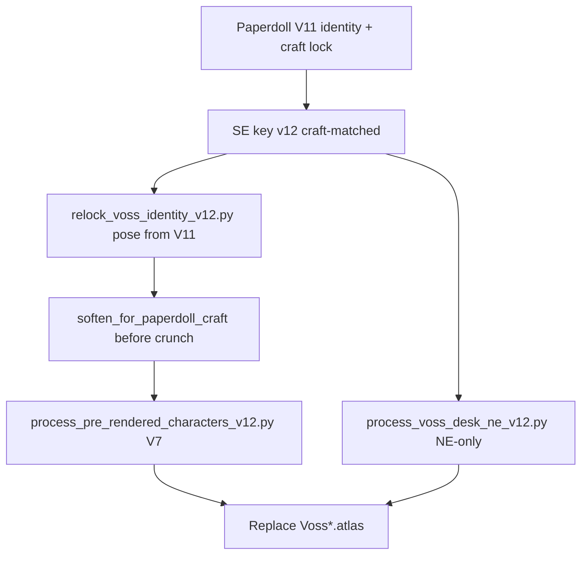

# Paperdoll → BGEE Sprite Redo Plan (V12)

- Status: installed
- Version: 1.0
- Date: 2 August 2026
- Scope: **Harlan Voss full atlas set** (walk, idle, SE desk, NE desk) + dialogue portrait refresh. Lila untouched. Inventory paperdoll unchanged (soft, no V7).

## 1. Goal

Re-lock every Voss gameplay master to the approved inventory paperdoll identity **and craft density**, then run the existing **V7 BGEE preprocess** (80 px native → 64 opaque-only colors → nearest → 200 px on 512×512, `FOOT_Y=434`) to replace shipped `Voss*.atlas` cells.

## 2. Why V12

| Prior | Problem |
|---|---|
| V11 room sprites | Drifted from paperdoll (tattered hem, over-weathered coat, identity slip) |
| First V12 SE key attempt | Over-detailed vs paperdoll (pores / microtexture / sharper face) |
| NE desk cells | Still Jul 31 / pre-V11 while office runtime prefers NE |

## 3. Pipeline



## 4. Processors

| Script | Role |
|---|---|
| [`relock_voss_identity_v12.py`](../ArtSource/Processing/relock_voss_identity_v12.py) | Paperdoll+key LAB/region lock on V11 pose frames; compose strips |
| [`process_pre_rendered_characters_v12.py`](../ArtSource/Processing/process_pre_rendered_characters_v12.py) | Voss-only V7 install; craft soften; SE desk; portrait Lanczos |
| [`process_voss_desk_ne_v12.py`](../ArtSource/Processing/process_voss_desk_ne_v12.py) | NE desk identity lock + shared-scale V7; **does not clobber SE** |

```bash
python3 ArtSource/Processing/relock_voss_identity_v12.py
python3 ArtSource/Processing/process_pre_rendered_characters_v12.py
python3 ArtSource/Processing/process_voss_desk_ne_v12.py
```

## 5. Authority

- Identity/craft: `voss_paperdoll_front_chroma_v11.png` / runtime `voss_paperdoll_front_rgba_v01`
- SE key: `Detective/PreRendered3DV12/voss_key_se_chroma_v12.png`
- Hard reject: more detailed than paperdoll; frayed coat hem; fedora
- Prompt: [`voss_key_se_v12.md`](../ArtSource/Prompts/voss_key_se_v12.md)

## 6. Out of scope

- Lila atlases
- Paperdoll nearest-pixelize
- Registration / display size / runtime mirroring changes
