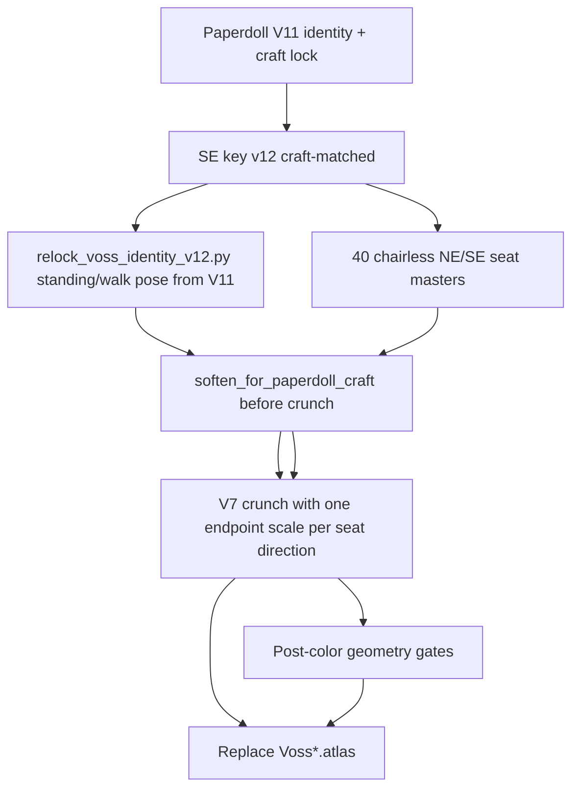

# Paperdoll → BGEE Sprite Redo Plan (V12)

- Status: installed
- Version: 1.1 (seat-scale correction)
- Date: 2 August 2026
- Scope: **Harlan Voss full atlas set** (walk, idle, SE desk, NE desk) + dialogue portrait refresh. Lila untouched. Inventory paperdoll unchanged (soft, no V7).

## 1. Goal

Re-lock every Voss gameplay master to the approved inventory paperdoll identity **and craft density**, then run the existing **V7 BGEE preprocess** (80 px native → 64 opaque-only colors → nearest → 200 px on 512×512, `FOOT_Y=434`) to replace shipped `Voss*.atlas` cells.

## 2. Why V12

| Prior | Problem |
|---|---|
| V11 room sprites | Drifted from paperdoll (tattered hem, over-weathered coat, identity slip) |
| First V12 SE key attempt | Over-detailed vs paperdoll (pores / microtexture / sharper face) |
| NE desk cells | Still Jul 31 / pre-V11 while office runtime prefers NE |

## 3. Pipeline



## 4. Processors

| Script | Role |
|---|---|
| [`relock_voss_identity_v12.py`](../ArtSource/Processing/relock_voss_identity_v12.py) | Paperdoll+key LAB/region lock on V11 pose frames; compose strips |
| [`process_pre_rendered_characters_v12.py`](../ArtSource/Processing/process_pre_rendered_characters_v12.py) | Voss-only V7 install; craft soften; required per-frame SE desk masters; one SE endpoint-derived scale; post-color validation; portrait Lanczos |
| [`process_voss_desk_ne_v12.py`](../ArtSource/Processing/process_voss_desk_ne_v12.py) | Required per-frame NE desk masters; one NE endpoint-derived scale; post-color validation; **does not clobber SE** |
| [`canonicalize_voss_seat_masters_v12.py`](../ArtSource/Processing/canonicalize_voss_seat_masters_v12.py) | Master authoring: one seated neutral + breathing idle edits, foot-anchored stand-up height curve, standing-endpoint handoff; writes chairless chroma cells the installers validate |
| [`generate_voss_seat_qa_v12.py`](../ArtSource/Processing/generate_voss_seat_qa_v12.py) | Read-only final-atlas QA: both directions' idle/transition contacts, paperdoll comparisons, exact reversal check, and fixed-232 office/chair sheets |

```bash
python3 ArtSource/Processing/relock_voss_identity_v12.py
python3 ArtSource/Processing/canonicalize_voss_seat_masters_v12.py
python3 ArtSource/Processing/process_pre_rendered_characters_v12.py
python3 ArtSource/Processing/process_voss_desk_ne_v12.py
python3 ArtSource/Processing/generate_voss_seat_qa_v12.py
```

## 5. Authority

- Identity/craft: `voss_paperdoll_front_chroma_v11.png` / runtime `voss_paperdoll_front_rgba_v01`
- SE key: `Detective/PreRendered3DV12/voss_key_se_chroma_v12.png`
- Seat pose authority: one approved seated neutral per direction plus the prior coherent stand-up geometry; edit the pose without reframing the camera or changing body scale
- Wardrobe color authority: inventory paperdoll coat/midtone means via `identity_wardrobe_lock` on **all** Voss atlases (walk, idle, seated, transitions). Walk is not the color target.
- Hard reject: more detailed than paperdoll; frayed coat hem; fedora; baked chair; independently reframed or resized seat cells
- Prompt: [`voss_key_se_v12.md`](../ArtSource/Prompts/voss_key_se_v12.md)

## 6. Out of scope

- Lila atlases
- Paperdoll nearest-pixelize
- Standing/walk registration and posture-specific runtime scale workarounds

## 7. Seat animation contract

- Each direction has eight seated-idle masters and twelve stand-up masters. Idle cells are constrained edits of one neutral: pelvis, feet, camera, and body scale remain fixed while only breathing and small upper-body motion change.
- Stand-up frame 00 matches the seated neutral; 01–03 plant the feet and lean forward; 04–07 lift and rise; 08–10 straighten; frame 11 matches the same direction's standing idle. Sit-down is the exact reverse of this clip, not independently authored.
- Voss cells never contain chair pixels. `office_desk_chair` is the sole chair owner and stays visible through seated idle, stand-up, sit-down, egress, and walking.
- Runtime selects one complete NE or SE seat set atomically. It carries that visual direction through the endpoint handoff; the primary NE set finishes through the mirrored-NW standing-idle selector.
- SpriteKit retains the fixed 232×232 node, scale 1, existing anchor/offsets, and 0.13-second transition frame timing.

## 8. Corrected V12 scale and validation pipeline

The last stand-up master supplies one uniform source-to-texture scale for every idle and transition cell in that direction. The V7 80px/64-color crunch, warm-brown correction, nearest enlargement, 512×512 canvas, alpha-1 corner sentinels, horizontal registration, and `FOOT_Y=434` remain unchanged. No head-derived idle scale, per-frame height interpolation, monotone resize, or anisotropic cycle lock is allowed. Geometry is measured only after color and alpha processing; a bad master stops generation instead of being stretched.

Baked gates:

- standing endpoint 198–202px opaque height; each seated-idle cell 150–160px;
- frame 00 within 3px of the idle neutral and frame 11 within 2px of the direction-matched standing idle;
- visible feet end on row 433 and the opaque bbox centre stays within 2px of canvas centre;
- visual-top head width (top 10%, kept above the bare-headed SE shoulder): NE 25–29px; SE within ±10% of its standing reference; no clip-wide drift above 12%;
- idle centroid drift no more than 2px and neutral-mask overlap at least 0.86;
- adjacent transition crown retreat no more than 4px and total crown rise 38–50px;
- every sit-down cell is pixel-equal to the corresponding reversed stand-up cell.
